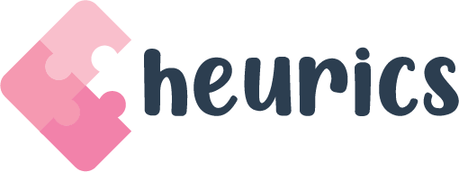

  

<h1 align="center">Game</h1>

built with [`React`](https://facebook.github.io/react/) 

    <ul>
        <li>
            <a href="#About">About</a>
        </li>
        <li>
            <a href="#Documentation">Documentation</a>
        </li>
        <li>
            <a href="#Vision">Vision</a>
        </li>
        <li>
            <a href="#Contributing">Contributing</a>
        </li>
        <li>
            <a href="#code-of-conduct">Code of Conduct</a>
        </li>
        <li>
            <a href="#Author">Author</a>
        </li>
    </ul>

  <h2>
    <a href="#TOC">About 🤷</a>
  </h2>
  

    Heurics is a web application that allows children between the ages of 5 and 11 develop problem solving skills while playing immersive games.       These games teach basic principles of programming logic such as loops and functions. Heurics is inspired by MIT's 
    ['Scratch'](https://scratch.mit.edu/) project
  

    <h2>
        <a href="#TOC">Documentation 📄</a>
    </h2>
    

      There is currently no documentation as the app is still in production. Check out <a href="#Vision"> Vision </a> to get a clearer understanding of the vision for Heurics
    

    <h2>
        <a href="#TOC"> Vision 🔭</a>
    </h2>
    

      Users should be able to select a game mode from two options which will decide the nature of their challenge - help cross chickens or find treasure out in the open seas. Users navigate the pirate's ship or direct the chickens crossing by dragging blocks of "code" from the toolbox column to the workbench where the codes can then be organised and run. The visual result of their coding will be displayed on the canvas where the users can run scripts and properly test their assumptions. A task is complete when the goal is reached without colliding with an obstacle. Logical for loops and functions will be implemented to optimize coding.
    

    <h2>
        <a href="#TOC"> Contributing :gear:</a>
    </h2>
    

      Heurics is open sourced and welcomes contributions from everyone. See <a href="./docs/CONTRIBUTING.md">CONTRIBUTING</a> for more details
    

    <h2>
        <a href="#TOC"> Code of Conduct 📜</a>
    </h2>
    

      As a community, we have rules and regulations which members abide by to ensure heurics remains a safe space for contributors.
     Read up <a href="./CODE_OF_CONDUCT.md">CODE OF CONDUCT</a> before making any contributions to this project.
    

    <h2>
        <a href="#TOC"> Author ✍️</a>
    </h2>
    

      Chimzi Chiorlu <a href="https://twitter.com/cechiorlu">@cechiorlu</a>
    

